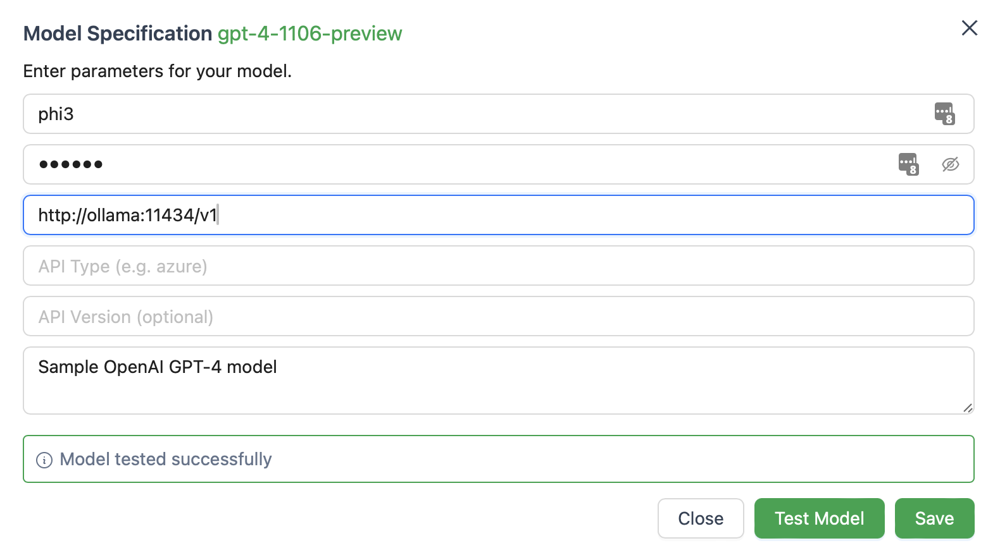

# MI5IX

A portable starting point for deploying local AI agents. Powered by [AutoGen-Studio](https://github.com/microsoft/autogen/tree/main/samples/apps/autogen-studio), [Docker](https://www.docker.com) and [Ollama](https://github.com/ollama/ollama).

## Quickstart

REQUIRES [DOCKER](https://www.docker.com)

```bash
./Quickstart
# Open http://localhost:8081
```

Set up a new model in AutoGen Studio with:



## Stock Price Benchmark

* GPT4-Turbo ~30s - PASS
* Phi3 15-60s - FAIL
