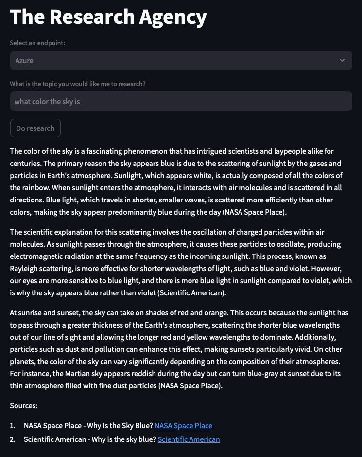

# MI5IX

A sandbox for multi-agent development powered by CrewAI and Streamlit.

## Quickstart

1. Set your environment variables in a file called .env using the [.env-example](.env-example) template:

```md
# Get yours here: https://platform.openai.com/account/api-keys
OPENAI_API_KEY=
OPENAI_API_VERSION=2024-02-01
# Get yours here: https://serper.dev/api-key
SERPER_API_KEY=
# Optional for Azure users
AZURE_OPENAI_API_KEY=
AZURE_OPENAI_RESOURCE=
AZURE_OPENAI_DEPLOYMENT=
```

2. Either use the .devcontainer or alternatively:

```bash
docker build -t mi5ix:latest -f .devcontainer/Dockerfile .
docker run -p 80:8501 --env-file .env mi5ix:latest streamlit run /app/agency/__main__.py
```

3. Open your Streamlit app at [http://localhost](http://localhost). Make sure to formulate your topic in the research example as a TOPIC, not a question:



### TODO

- [ ] Add Streamlit chat function to bring the human back in the loop

- [ ] Add local Phi3 instance via Ollama
